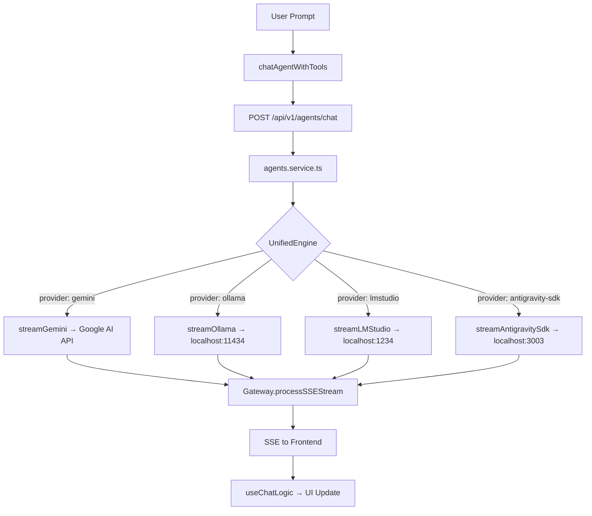

# NYX — Complete Codebase Audit & Architecture Documentation

> **Version:** Current production branch  
> **Monorepo Manager:** pnpm + Turborepo  
> **Last Audited:** June 2026  

This document is a full technical audit and architecture breakdown of the NYX AI Orchestration Platform. It covers every major module, service, class, function, and data flow in the entire application — frontend, backend, and shared libraries.

---

## Table of Contents

1. [Monorepo Overview](#1-monorepo-overview)
2. [Shared Packages (`packages/`)](#2-shared-packages)
3. [Backend Deep Dive (`apps/server`)](#3-backend-deep-dive)
4. [Frontend Deep Dive (`apps/web`)](#4-frontend-deep-dive)
5. [AI Provider Ecosystem](#5-ai-provider-ecosystem)
6. [Chat Agent Architecture](#6-chat-agent-architecture)
7. [Coder Agent Architecture](#7-coder-agent-architecture)
8. [The Cline SDK Layer](#8-the-cline-sdk-layer)
9. [The Antigravity SDK & Service](#9-the-antigravity-sdk--service)
10. [Complete Request Lifecycle — End to End](#10-complete-request-lifecycle--end-to-end)
11. [Local Models: Ollama & LM Studio](#11-local-models-ollama--lm-studio)
12. [Cloud Models: Google Gen AI (Gemini)](#12-cloud-models-google-gen-ai-gemini)
13. [Smart Router & Circuit Breaker](#13-smart-router--circuit-breaker)
14. [SSE Streaming Gateway](#14-sse-streaming-gateway)
15. [State Management & Stores](#15-state-management--stores)
16. [Database & Persistence Layer](#16-database--persistence-layer)
17. [Security, Vault & API Keys](#17-security-vault--api-keys)
18. [Background Services & Bootstrap](#18-background-services--bootstrap)
19. [Complete File Reference](#19-complete-file-reference)

---

## 1. Monorepo Overview

```text
NYX/
├── apps/
│   ├── web/           → Vite + React 19 frontend (Chat UI, Coder UI, Settings)
│   ├── server/        → Node.js + Fastify backend (AI Engine, Gateway, APIs)
│   ├── desktop/       → Tauri/Electron desktop wrapper
│   └── uploads/       → Sandboxed user file upload storage
│
├── packages/
│   ├── shared/        → Shared TypeScript types, model presets, provider logic
│   ├── config/        → Shared ESLint + TypeScript build configs
│   └── ui/            → Shared Tailwind-based React component library
│
├── turbo.json         → Turborepo task pipeline (build, dev, test)
├── pnpm-workspace.yaml → pnpm workspace declarations
└── .env               → Global environment variables (API keys, ports)
```

### Build Pipeline (Turborepo)

```
pnpm run dev
  └── turbo run dev
        ├── @nyx/shared:build  (first — shared types must compile before apps)
        ├── @nyx/server:dev    (Fastify backend, port 3010)
        └── @nyx/web:dev       (Vite HMR, port 5173, proxies /api/* to 3010)
```

---

## 2. Shared Packages

### `packages/shared/src/types.ts` — Core Type Contracts

This is the **single source of truth** for data shapes shared across frontend and backend.

| Type / Schema | Description |
|---|---|
| `ModelProvider` | Union type: `'gemini' \| 'ollama' \| 'lmstudio' \| 'antigravity-sdk' \| 'terminal'` |
| `ChatMessage` | `{ role: 'user' \| 'assistant' \| 'system'; content: string; images?: ImageData[] }` |
| `AISettings` | `{ temperature, maxTokens, topP, topK, antigravity?: boolean }` |
| `ModelOption` | `{ id, name, provider, description, specs: { contextWindow, modality, ... } }` |
| `ModelOptionSchema` | Zod schema validating `ModelOption` at runtime |

These types are exported from `@nyx/shared` and imported into both `apps/web` and `apps/server`, guaranteeing zero type drift.

---

### `packages/shared/src/models.ts` — Model Registry

The **model registry** is a static array of all models available in the NYX model selector.

```typescript
const AVAILABLE_MODELS: ModelOption[] = [
  // Gemini Cloud Series
  { id: 'gemini-3.5-flash',  provider: 'gemini',  contextWindow: '1M'  },
  { id: 'gemini-3-flash',    provider: 'gemini',  contextWindow: '1M'  },
  { id: 'gemini-3.1-pro',    provider: 'gemini',  contextWindow: '2M'  },
  { id: 'gemini-2.5-flash',  provider: 'gemini',  contextWindow: '1M'  },
  { id: 'gemma-4-31b-it',    provider: 'gemini',  contextWindow: '256K'},
  { id: 'gemma-4-27b-it',    provider: 'gemini',  contextWindow: '256K'},
  // Local Presets (routed to Ollama)
  { id: 'nyx-gemma-4-e2b-it',         provider: 'ollama' },
  { id: 'qwen2.5-coder-1.5b-native',  provider: 'ollama' },
  { id: 'qwen2.5-coder-3b-native',    provider: 'ollama' },
  { id: 'llama-3.2-3b-native',        provider: 'ollama' },
]
```

All entries are deduplicated by ID and then **filtered** against `ALLOWED_PROVIDERS = ['gemini', 'ollama', 'lmstudio', 'antigravity-sdk']` before being exported. This ensures zero obsolete or unsupported provider references reach the UI.

---

### `packages/shared/src/provider.ts` — Provider Resolution Engine

This is one of the most critical shared utilities. It contains all logic for deciding which AI backend should process a given model ID.

#### `detectProvider(modelId: string): Provider`
**Priority order:**
1. `ollama/` or `ollama:` prefix → returns `'ollama'`
2. `lmstudio/` prefix → returns `'lmstudio'`
3. Checks `LOCAL_MODEL_IDS` set (hardcoded list of known local model strings) → returns `'ollama'`
4. Checks `AVAILABLE_MODELS` registry → returns the model's registered provider
5. `.gguf` file extension or `custom-` prefix → returns `'ollama'`
6. **Fallback**: returns `'gemini'`

#### `getModelCapabilities(modelId: string): ModelCapabilities`
Returns the full capability matrix for any model:
- `supportsVision` — whether the model can process images
- `supportsTools` — whether the model can call function declarations
- `supportsStreaming` — always `true` for all registered models
- `supportsSystemPrompt` — always `true`
- `contextWindow` — maximum input token count (e.g. `2097152` for Gemini 2.5 Pro)

#### Health Tracking
The module also implements a **circuit-breaker pattern** for model health:
- `recordModelError(modelId)` — increments failure count
- `recordModelSuccess(modelId)` — resets failure count
- `isModelHealthy(modelId)` — returns `false` if ≥3 failures within the last 60 seconds (prevents cascading failures)

---

## 3. Backend Deep Dive

The backend is a **Node.js 20 + Fastify 5** application running on port `3010`. It acts as a secure broker and AI streaming gateway.

### Server Entry Point: `apps/server/server.ts`

```
server.ts
  └── Loads env variables
  └── Initializes Fastify via fastifyConfig.ts
  └── Calls bootstrap: initializeDatabaseAndPlugins()
  └── Calls bootstrap: spawnBackgroundServices() (Antigravity + Scrapling)
  └── Registers all routers under /api/v1/
  └── Starts listening on port 3010
```

### `apps/server/server/lib/fastifyConfig.ts` — Server Configuration

Configures all Fastify plugins:
- `@fastify/cors` — allows requests from `localhost:5173` (Vite dev server)
- `@fastify/multipart` — for file upload endpoints
- `@fastify/static` — serves the built frontend dist in production
- `@fastify/swagger` — auto-generates OpenAPI docs from route schemas
- `pino` logger — structured JSON logging for all requests

### Backend Feature Directory Structure

```text
apps/server/server/features/
├── agents/          → Agent streaming (chat + coder), Cline SDK integration
├── ai-providers/    → Gemini-specific router & service
├── auth/            → JWT auth middleware
├── cache/           → Redis-backed response caching
├── chat/            → Conversation persistence (sessions, history)
├── conversations/   → SQLite conversation storage & migrations
├── files/           → File upload endpoints
├── graphql/         → (Optional) GraphQL API layer
├── local-models/    → Ollama management API (list, pull, delete)
├── model-proxy/     → Proxy endpoints for external model APIs
├── nyx/             → NYX-native services (filesystem, search, workspace, agent)
├── prompts/         → Prompt template registry & management
├── rag/             → RAG (Retrieval-Augmented Generation) indexing
├── sessions/        → Session token management
├── terminal/        → Sandboxed terminal process management
├── tools/           → Tool execution framework
├── upload/          → File processing pipeline
└── vault/           → Encrypted API key storage
```

---

## 4. Frontend Deep Dive

The frontend is a **React 19 + Vite 6 + TypeScript** SPA. It communicates with the backend exclusively through `fetch()` to `/api/v1/*` endpoints (proxied by Vite in dev).

### Frontend Source Structure

```text
apps/web/src/
├── app/             → Root app, router, layout shell
├── components/      → Global reusable components
├── core/            → Core agent logic and client SDK
│   ├── agents/      → chatAgentWithTools.ts, coderAgentWithTools.ts, baseAgent.ts
│   ├── services/    → Prompt classifier, infrastructure utilities
│   └── tools/       → Client-side tool definitions
├── features/        → Feature-based UI modules
│   ├── chat/        → Chat page: hooks, components, services, workers
│   ├── coder/       → Coder page: pipeline, collaboration, store
│   ├── settings/    → Settings panel
│   ├── model-registry/ → Model library browser
│   └── ... (31 total feature modules)
├── views/           → Page-level view components (ChatView, CoderView)
├── stores/          → Zustand global state stores
├── hooks/           → Global React hooks
└── main.tsx         → React root, initializes stores & router
```

---

## 5. AI Provider Ecosystem

NYX supports **4 distinct AI provider backends**. All providers normalize to the same `ChatMessage[]` format before reaching any provider-specific code.



### Provider Summary Table

| Provider | Type | Endpoint | Auth | Tools Support |
|---|---|---|---|---|
| `gemini` | Cloud | `https://generativelanguage.googleapis.com` | API Key | ✅ Full |
| `ollama` | Local | `http://127.0.0.1:11434` | None | ❌ Disabled |
| `lmstudio` | Local | `http://127.0.0.1:1234` | None | ❌ Disabled |
| `antigravity-sdk` | Local Service | `http://127.0.0.1:3003` | Optional Key | ✅ Via service |

---

## 6. Chat Agent Architecture

The Chat Agent is responsible for general conversational AI interactions.

### Client-Side: `chatAgentWithTools.ts`

This class extends `BaseAgent` and implements the `streamResponse()` async generator.

**Execution Flow:**
1. Receives `prompt`, `analysis`, `signal`, `searchContext`, `images` from the React hook
2. Slices conversation history to the last `HISTORY_SLICE_SIZE` messages (prevents context overflow)
3. If `searchContext` is provided (from a web search pre-step), prepends it to history as a user message
4. Constructs the POST request body: `{ model, provider, prompt, history, apiKey, gatewayUrls, images }`
5. Sends `fetch('/api/v1/agents/chat', ...)` and opens a streaming response body reader
6. Iterates SSE chunks, parsing `data: {...}` events:
   - `{ chunk }` → `yield { type: 'text', content }`
   - `{ tool_call }` → `yield { type: 'tool_call', ... }`
   - `{ tool_result }` → `yield { type: 'tool_result', ... }`
   - `[DONE]` → emits a final thinking event and returns

### Server-Side: `agents.service.ts → AgentsService`

**`executeAgentStream(params, onChunk, onDone)`**:
1. **Provider resolution:** Checks `requestedProvider`, then infers from model ID prefix (`ollama/`, `lmstudio/`)
2. **Tool selection:** Calls `getToolsForAgent('chat')` → returns `[searchWeb]` tool declaration
3. **System prompt:** Loads from `promptRegistry` (database-backed). Falls back to: `"You are an advanced AI assistant. You have access to search the web and read files."` + strict anti-hallucination formatting instructions
4. **Message construction:** Assembles `[system, ...history, user]` message array
5. **Delegates** to `UnifiedEngine.executeStream()` with `tools: undefined` if provider is local

### Server-Side: `agents.router.ts` — `/api/v1/agents/chat`

```typescript
fastify.post('/chat', async (request, reply) => {
  await handleAgentStream(request, reply, 'chat');
});
```

`handleAgentStream`:
1. Unpacks `{ model, provider, prompt, history, apiKey, gatewayUrls, images }` from request body
2. Initializes SSE on the Fastify reply (`Content-Type: text/event-stream`)
3. Sends an initial `token-rotate` SSE heartbeat to keep the connection alive
4. Calls `service.executeAgentStream(...)` with:
   - `onChunk` callback: writes `data: ${JSON.stringify(chunk)}\n\n` to raw HTTP response
   - `onDone` callback: writes `data: [DONE]\n\n` and closes the connection
5. On error: writes `data: { error: message }` and closes the stream safely

### Client Hook: `useChatLogic.ts`

This is the primary React hook that orchestrates the entire chat page state machine.

**Responsibilities:**
- Maintains `messages: ChatMessage[]` state array
- Creates `AbortController` per request for cancellation support
- On message submission, calls `chatAgentWithTools.streamResponse()` as an async generator
- Iterates the generator, appending chunks to the current assistant message via React state updates
- Handles `tool_call` events by displaying a "Searching..." indicator in the UI
- Manages loading states, error banners, and stop-generation button visibility

---

## 7. Coder Agent Architecture

The Coder Agent is a more sophisticated, autonomous coding agent. It uses the **Cline SDK** instead of the simple streaming pipeline.

### Client-Side: `coderAgentWithTools.ts`

**Key differences from Chat Agent:**
- Uses endpoint `/api/v1/agents/coder` instead of `/agents/chat`
- Automatically gathers workspace file context before sending
- Parses richer event types from the Cline SDK event stream:
  - `assistant-text-delta` → append text chunk
  - `tool-use` → show tool execution UI
  - `tool-result` → show tool result
  - `error` → display error

### Server-Side: `cline.service.ts → ClineService`

This is the **autonomous agentic execution engine** for the Coder. It wraps the **official `@cline/sdk`**.

**`executeClineAgent(params, onEvent)`:**

1. **Provider resolution:** Gemini models are mapped to their real API ID via `resolveRealGeminiModel()`. Local model strings are routed to an `openai-compatible` provider type.

2. **Tool registration:** Instantiates all 9 custom tools:

| Tool | Function |
|---|---|
| `read_file` | Reads files from the workspace via `FilesystemService` |
| `write_file` | Writes/overwrites files in the workspace |
| `run_command` | Spawns sandboxed terminal processes via `TerminalService` |
| `search_codebase` | Semantic search over workspace files via `SearchService` |
| `web_search` | Live web search via `SearchService.performWebSearch()` |
| `validate_code` | Runs linting + type checking on the workspace |
| `get_workspace_info` | Returns file tree, file count, top-level structure |
| `run_code` | Executes code snippets (JS, TS, Python, Shell) in temp files |
| `get_evolutionary_rules` | Fetches learned coding patterns from previous sessions via `AgentService` |

3. **Agent instantiation:** Creates a `new Agent({ providerId, modelId, apiKey, tools, systemPrompt })` from `@cline/sdk`

4. **Event subscription:** `agent.subscribe(onEvent)` pipes all events back through SSE to the frontend

5. **Retry logic:** On empty model output errors, retries with a "nudge prompt" up to 2 times

6. **Fallback messaging:** If all retries fail, sends a human-readable error message explaining the issue and recommending model switching

---

## 8. The Cline SDK Layer

The `@cline/sdk` is an external agentic execution SDK that manages **multi-turn autonomous loops** where the AI can call tools, observe results, and continue until the task is complete.

**How it works inside NYX:**

```
ClineService.executeClineAgent()
  └── new Agent({ model, tools, systemPrompt })
        ├── agent.run(prompt) → Sends to LLM
        │     └── LLM returns text OR a tool call
        │
        ├── If tool call:
        │     ├── SDK executes the matching createTool.execute() function
        │     ├── Tool result injected back into message history
        │     └── LLM is called again automatically
        │
        └── If text: emit 'assistant-text-delta' event
              └── ClineService calls onEvent(event)
                    └── Fastify writes to SSE stream
                          └── Frontend renders chunk
```

**Important constraint:** Cline SDK tools are only active when using Gemini (cloud). For local Ollama/LM Studio, the `provider` in `agents.service.ts` is overridden to `'openai-compatible'` and a mock key is used — this is a current limitation because most small local models do not support the complex tool-call JSON format.

---

## 9. The Antigravity SDK & Service

The Antigravity system is NYX's internal **prompt intelligence layer**. It is implemented as a **Python microservice** (`server/python/antigravity_service.py`) that runs alongside the Node.js server.

### Startup
At server startup (`bootstrap.ts: spawnBackgroundServices()`):
```
spawn('python', ['antigravity_service.py', '--port', ANTIGRAVITY_PORT])
  └── Registers to processRegistry for graceful shutdown
  └── Health-checks every 15 seconds at /health
  └── Auto-restarts if health check fails
```

### Role 1: Prompt Preprocessing Middleware

When `settings.antigravity = true` on a request, `UnifiedEngine` calls `/preprocess` **before** the main LLM:

```
User prompt → POST http://127.0.0.1:3003/preprocess
  → Antigravity Service classifies domain (general/coding/creative)
  → Rewrites prompt for clarity, reduces ambiguity, adds implicit context
  → Returns { prompt: "enhanced prompt", domain, version }
  → Enhanced prompt replaces original in message array
  → Optimization record saved to SQLite (promptOptimizations table)
  → Small metadata comment injected into stream: <!-- ANTIGRAVITY_META:uuid -->
```

### Role 2: Direct Generation Provider

When `provider: 'antigravity-sdk'` is selected in the model selector:
```
UnifiedEngine.streamAntigravitySdk()
  → POST http://127.0.0.1:3003/generate
  → Body: { prompt, model, apiKey }
  → Antigravity Service uses its own internal model chain to generate
  → Streams back SSE via Gateway.processSSEStream()
```

### Abstention Training

`aiEngine.ts` injects this instruction into **every** system prompt regardless of provider:

> *"If you are unsure about an API, function, library, or implementation detail... explicitly state 'I don't have enough context to answer this reliably' rather than guessing."*

This reduces hallucination across all models by training them to prefer accurate silence over confident inaccuracy.

---

## 10. Complete Request Lifecycle — End to End

The following is the **precise, code-accurate** sequence of every step taken from a user typing to text appearing on screen.

```
[USER] Types "Explain async/await in Python" → selects "Qwen 2.5 Coder 3B (GGUF)" → clicks Send

FRONTEND (apps/web):
  1. useChatLogic.handleSubmit(prompt) is called
  2. Creates AbortController for cancellation
  3. Optimistically appends user message to messages[] state → React re-renders
  4. Calls chatAgentWithTools.streamResponse(prompt, analysis, signal)
  5. ChatAgentWithTools.streamResponse():
     a. Slices history to last N messages
     b. Constructs body: { model: 'qwen2.5-coder-3b-native', provider: 'ollama', prompt, history, apiKey: '' }
     c. fetch('/api/v1/agents/chat', { method: 'POST', body, signal })
     d. Opens response.body.getReader()

BACKEND (apps/server) — Fastify receives POST /api/v1/agents/chat:
  6. agents.router.ts:handleAgentStream() is invoked
  7. Validates `model` field is present (400 if missing)
  8. initFastifySse(reply) → sets Content-Type: text/event-stream headers
  9. sendSseTokenRotate(reply.raw) → sends a heartbeat event
  10. Calls service.executeAgentStream({ model, provider: 'ollama', prompt, history, agentType: 'chat' }, onChunk, onDone)

AGENTS SERVICE:
  11. resolvedProvider = 'ollama' (from request body's provider field)
  12. tools = getToolsForAgent('chat') → [searchWeb]
  13. systemInstruction = await promptRegistry.getActive('system-prompt-chat') || fallback string
  14. Constructs messages[] = [{ role: 'system', content }, ...history, { role: 'user', content: prompt }]
  15. Calls UnifiedEngine.executeStream({ provider: 'ollama', model: 'qwen2.5-coder-3b-native', messages, tools: undefined })

UNIFIED ENGINE:
  16. Skips SmartRouter (local provider, no routing needed)
  17. Skips Antigravity preprocessing (settings.antigravity not set)
  18. Calls injectAbstentionInstruction(messages) → appends anti-hallucination text to system message
  19. Calls compressPrompt() on user message (caps at 64K tokens)
  20. Gateway.validateAuth('ollama', ...) → returns { valid: true } (no key needed for local)
  21. Switch statement hits case 'ollama': calls this.streamOllama()

STREAM OLLAMA:
  22. Strips prefix: 'qwen2.5-coder-3b-native' (no prefix to strip)
  23. Creates AbortController with 120s timeout
  24. fetch('http://127.0.0.1:11434/v1/chat/completions', {
        model: 'qwen2.5-coder-3b-native',
        messages: [{ role: 'system', ... }, { role: 'user', content: 'Explain async/await in Python' }],
        stream: true, temperature: 0.7, max_tokens: 4096
      })
  25. Ollama receives request → loads GGUF model → starts token generation

SSE GATEWAY (processSSEStream):
  26. Reads response.body byte-by-byte with ReadableStreamDefaultReader
  27. Decodes with TextDecoder(stream: true)
  28. Finds lines starting with 'data: '
  29. Parses JSON: { choices: [{ delta: { content: "Async" } }] }
  30. Extracts delta.content → "Async"
  31. Calls callbacks.onChunk("Async")

ROUTER CALLBACK:
  32. onChunk("Async") → writes: 'data: {"chunk":"Async"}\n\n' to HTTP response

FRONTEND (reading the SSE stream):
  33. reader.read() returns the bytes for 'data: {"chunk":"Async"}\n\n'
  34. Parses JSON: { chunk: "Async" }
  35. yield { type: 'text', content: 'Async' }
  36. useChatLogic appends "Async" to the current assistant message state
  37. React re-renders the message → user sees "Async" appear

Steps 26–37 repeat for every token until Ollama sends: data: [DONE]

COMPLETION:
  38. onDone() → writes 'data: [DONE]\n\n' → closes HTTP response
  39. Frontend reader hits done=true
  40. yield* this.emitThinking('Task complete.')
  41. useChatLogic sets isLoading=false
  42. Stop button disappears, final message is saved to conversation history
```

---

## 11. Local Models: Ollama & LM Studio

### Ollama Integration

**What Ollama is:** A local daemon that manages and serves open-weight LLM models. It exposes an OpenAI-compatible REST API on port `11434`.

**Backend Connection (`streamOllama` in `aiEngine.ts`):**
- Endpoint: `http://127.0.0.1:11434/v1/chat/completions`
- Payload format: OpenAI-compatible JSON (`model`, `messages`, `stream: true`, `temperature`, `max_tokens`, `top_p`)
- Model prefix stripping: `"ollama/llama3"` → `"llama3"` before sending
- Timeout: 120 seconds (large models can be slow to generate)
- No authentication required

**Model Management API (`localModels.service.ts`):**
- `listOllamaModels()` — fetches `http://127.0.0.1:11434/api/tags`. Falls back to filesystem scan of `~/.ollama/models/manifests/` if the API is down
- `pullOllamaModel(name)` — POST to `/api/pull` to download a model
- `deleteOllamaModel(name)` — DELETE to `/api/delete`

---

### LM Studio Integration

**What LM Studio is:** A GUI application for running GGUF models locally. It exposes an OpenAI-compatible REST API on port `1234`.

**Backend Connection (`streamLMStudio` in `aiEngine.ts`):**
- Endpoint: `http://127.0.0.1:1234/v1/chat/completions`
- Payload: Identical format to Ollama
- Model prefix stripping: `"lmstudio/publisher/model"` → `"publisher/model"`
- Timeout: 120 seconds
- No authentication required

**Note:** LM Studio does not have a model management API. Users load models manually in the LM Studio GUI, then NYX connects to whatever model LM Studio has loaded.

---

## 12. Cloud Models: Google Gen AI (Gemini)

**How Gemini streaming works (`streamGemini` in `aiEngine.ts`):**

1. `resolveRealGeminiModel(model)` maps user-facing names to real API IDs:
   - `'gemini-3.1-pro'` → `'gemini-3.1-pro-preview'`
   - `'gemma-4-27b-it'` → `'gemma-4-26b-a4b-it'`
2. `Gateway.buildUrl()` constructs the full URL — supports optional **Cloudflare AI Gateway** proxy for rate limiting & analytics
3. `Gateway.formatMessages(messages, 'gemini')` converts the standard `ChatMessage[]` to Gemini's content format:
   - Separates `system` role messages into `systemInstruction` field
   - Maps `assistant` → `model` (Gemini's role name)
   - Converts image attachments to `inlineData: { mimeType, data }` format
   - Handles `functionCall` and `functionResponse` parts for tool use
4. Sends POST to Google's `streamGenerateContent?alt=sse` endpoint
5. Passes response to `Gateway.processSSEStream()` which handles Gemini-format chunks:
   - Extracts `candidates[0].content.parts[0].text` (Gemini format)
   - Extracts `candidates[0].content.parts[0].functionCall` for tool calls

**Generation Config sent to Gemini:**
```json
{
  "temperature": 0.1,
  "maxOutputTokens": <settings.maxTokens>,
  "topP": 0.9,
  "topK": 20
}
```

Note: Temperature is set aggressively low (`0.1`) by default to maximize code accuracy and determinism.

---

## 13. Smart Router & Circuit Breaker

**`SmartRouter` (`apps/server/server/lib/router.ts`)**

The SmartRouter is used for cloud providers. It implements **intelligent routing** with cost/latency/capability scoring.

**`route(prompt, config, apiKeys) → RoutingDecision`:**

For each candidate model (primary + fallbacks):
1. Skip if no API key available
2. Skip if provider health shows `status: 'down'` within last 60 seconds
3. Estimate cost: `(promptTokens × inputPrice) + (outputTokens × outputPrice)`
4. Estimate latency: provider-based baseline (Ollama: 200ms, Gemini: 500ms, OpenRouter: 800ms)
5. Score = `capabilityScore × 0.5 + costScore × 0.3 + latencyScore × 0.2`
6. Select highest-scoring valid candidate

**Capability scoring factors:**
- Coding keywords in prompt → prefer `coder`/`code` models (+0.3)
- Long context (>10K chars) → prefer large context window models (+0.2)
- Image/vision keywords → prefer multimodal models (+0.3)

The SmartRouter also maintains **exponential weighted moving averages (EWMA)** of provider latency via `updateProviderHealth()`.

---

## 14. SSE Streaming Gateway

**`Gateway.processSSEStream(response, callbacks)` — The Heart of Real-Time Streaming**

This static method is called by every provider streamer (Gemini, Ollama, LM Studio, Antigravity). It is the universal byte-to-text bridge.

**Algorithm:**
```
1. Get response.body.getReader() — raw byte stream
2. Create TextDecoder for utf-8 decoding
3. Maintain a string buffer for partial chunks

Loop:
  4. reader.read() → get next byte chunk
  5. buffer += decoder.decode(value, { stream: true })
  6. Find newline boundaries in buffer
  7. For each complete line:
     - If line is empty: process accumulated event data
     - If line starts with 'data:': append data portion to eventData[]
     - If line starts with 'error:': call onError() and return
  8. Process event:
     - '[DONE]' → call onDone() and return
     - Parse JSON
     - Extract delta.content (OpenAI format)
     - Extract candidates[0].content.parts[0].text (Gemini format)
     - Extract functionCall if present
     - If finish_reason === 'stop'/'STOP'/'length' → call onDone()
  9. Trim processed portion from buffer
  10. On AbortError: call onDone() silently (user cancelled)
  11. On other errors: call onError(message)
```

---

## 15. State Management & Stores

The frontend uses **Zustand** for global state management.

| Store | File | Purpose |
|---|---|---|
| `useAppStore` | `stores/useAppStore.ts` | Global app settings, active model, API keys, theme |
| `useChatStore` | `stores/useChatStore.ts` | Current conversation messages, chat session ID |
| `useCoderStore` | `stores/useCoderStore.ts` | Coder page state: workspace path, active file, task history |

---

## 16. Database & Persistence Layer

The backend uses **SQLite** (via Drizzle ORM) for local persistence. The database file is `nyx.db` at the project root.

### Key Tables

| Table | Purpose |
|---|---|
| `conversations` | Stores all chat conversation metadata (ID, title, created_at) |
| `messages` | Individual chat messages tied to a conversation |
| `prompt_templates` | User-created and system prompt templates |
| `prompt_optimizations` | Logs of Antigravity prompt rewrites (original → enhanced) |
| `vault_keys` | Encrypted API keys storage |
| `sessions` | User auth session tokens |

### Migrations
`apps/server/server/db/migrator.ts` runs `runMigrations()` on every server start, applying any new Drizzle schema changes non-destructively.

---

## 17. Security, Vault & API Keys

**`apps/server/server/features/vault/`**

NYX uses a local encrypted vault to store API keys. This means:
- API keys are **never** stored in plain text
- `vault.service.ts` reads/writes from an encrypted JSON file at `.nyx-keys/`
- `Gateway.getActiveKey(provider, userKey)` resolution order:
  1. **User-provided key** (sent in request from frontend settings)
  2. **Vault key** (encrypted local storage)
  3. **System environment variable** (`GEMINI_API_KEY` from `.env`)
- Local providers (`ollama`, `lmstudio`) always return `{ valid: true }` without any key check

---

## 18. Background Services & Bootstrap

**`apps/server/server/lib/bootstrap.ts`**

At server startup, `spawnBackgroundServices()` launches two Python microservices as child processes:

### Scrapling Service
- **Port:** `SCRAPLING_PORT` (from env)
- **Purpose:** Python web scraping service using the `scrapling` library (faster than Playwright for simple scraping)
- **Health check:** Every 15 seconds at `/health`
- **Auto-restart:** On health check failure, kills and re-spawns with 2-second delay

### Antigravity Service
- **Port:** `ANTIGRAVITY_PORT` (from env, default `3003`)
- **Purpose:** Prompt preprocessing and alternative generation (see Section 9)
- **Health check:** Every 15 seconds at `/health`
- **Auto-restart:** Same pattern as Scrapling

### Startup Dependency Checks (`runDependencyHealthChecks()`)
On startup, NYX checks:
- **Python** availability (required for Scrapling + Antigravity)
- **llama-server binary** presence (optional, for GGUF model serving)
- **GPU/Driver** detection via `wmic` on Windows (Vulkan check on Linux)

All checks are non-fatal — the server continues starting even if dependencies are missing, but warnings are logged.

---

## 19. Complete File Reference

### Backend Core Files

| File | Role |
|---|---|
| `server/lib/aiEngine.ts` | Unified provider dispatch + all 4 streamer methods |
| `server/lib/gateway.ts` | SSE processing, URL building, auth, message formatting |
| `server/lib/router.ts` | SmartRouter: cost/latency/capability scoring |
| `server/lib/bootstrap.ts` | Startup: DB migrations, Python services, health checks |
| `server/lib/fastifyConfig.ts` | Fastify plugins and server configuration |
| `server/lib/sseHelpers.ts` | SSE initialization utilities |
| `server/lib/unifiedEngine.ts` | Extended engine with additional capabilities |
| `server/features/agents/agents.router.ts` | HTTP routing: `/chat` and `/coder` endpoints |
| `server/features/agents/agents.service.ts` | Agent business logic, system prompt injection |
| `server/features/agents/cline.service.ts` | Cline SDK integration, all 9 tool definitions |
| `server/features/agents/AgentOrchestrator.ts` | Multi-agent task orchestration |
| `server/features/local-models/localModels.service.ts` | Ollama model management API |
| `server/features/vault/vault.service.ts` | Encrypted API key management |
| `server/features/prompts/registry.ts` | Prompt template registry and active-prompt selection |
| `server/features/terminal/terminal.service.ts` | Sandboxed process spawning |

### Frontend Core Files

| File | Role |
|---|---|
| `core/agents/chatAgentWithTools.ts` | Chat agent SSE client and stream parser |
| `core/agents/coderAgentWithTools.ts` | Coder agent SSE client for Cline events |
| `core/agents/baseAgent.ts` | Abstract base with thinking/emit utilities |
| `core/agents/chatAgent.ts` | Extended chat agent with additional context handling |
| `core/agents/coderAgent.ts` | Full coder agent pipeline |
| `features/chat/hooks/useChatLogic.ts` | Chat page state machine (messages, loading, errors) |
| `features/chat/hooks/useChatPipeline.ts` | Pipeline orchestration for chat workflows |
| `features/coder/services/SubagentOrchestrator.ts` | Client-side multi-agent orchestration |
| `stores/useAppStore.ts` | Global settings store (model, API keys, theme) |
| `stores/useChatStore.ts` | Chat messages and session store |
| `stores/useCoderStore.ts` | Coder workspace state |
| `views/ChatView.tsx` | Chat page view component |
| `views/CoderView.tsx` | Coder page view component |

### Shared Package Files

| File | Role |
|---|---|
| `packages/shared/src/types.ts` | Core TypeScript types and Zod schemas |
| `packages/shared/src/models.ts` | All available model presets and registry |
| `packages/shared/src/provider.ts` | Provider detection, capabilities, health tracking |
